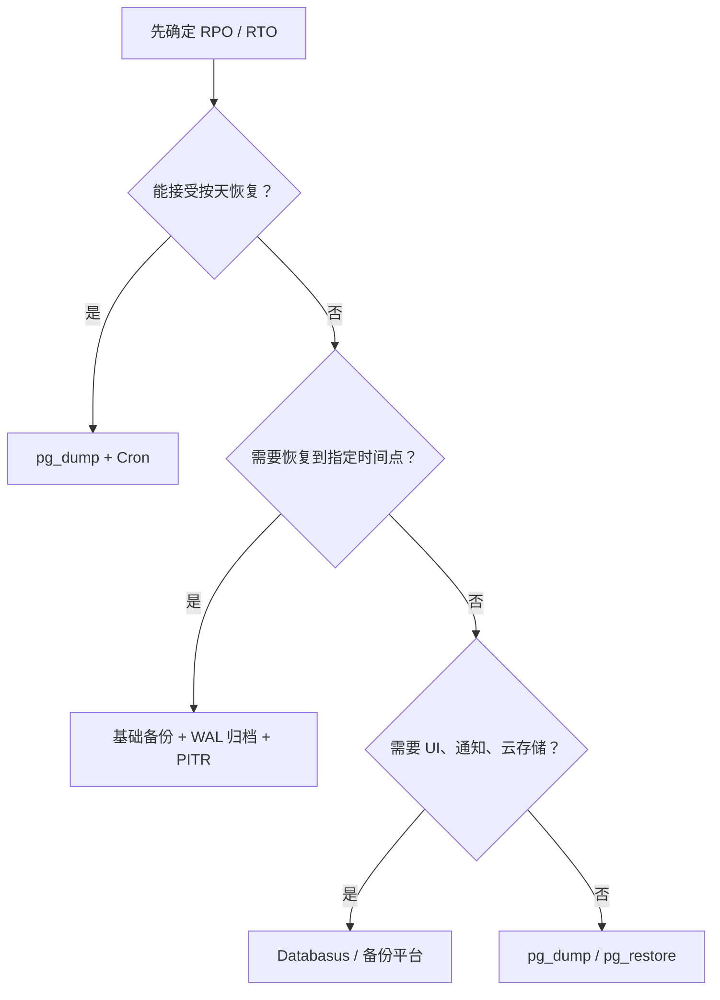
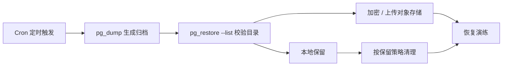
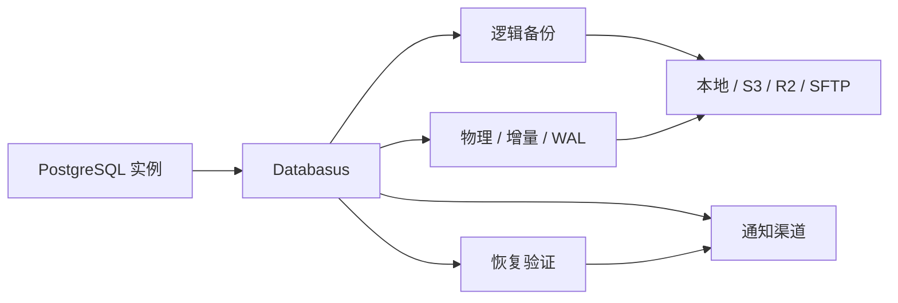

## 备份方案应该先回答什么问题

PostgreSQL 备份不只是“把数据库导出来”。真正需要先确定的是两个恢复目标：

- **RPO（Recovery Point Objective）**：最多能接受丢失多久的数据。例如每天凌晨备份一次，理论上最多可能丢失接近 24 小时的数据。
- **RTO（Recovery Time Objective）**：故障后多久必须恢复服务。例如 10 分钟内恢复、1 小时内恢复，或者只要求当天恢复。

不同备份方案解决的问题不同。`pg_dump` 适合做逻辑备份、迁移和小中型数据库的定期快照；PITR（Point-In-Time Recovery）适合生产环境的灾难恢复，可以把数据库恢复到某个具体时间点；第三方工具则通常把调度、存储、告警、加密和恢复验证做成产品化流程。

| 场景 | 推荐方案 | 恢复能力 | 复杂度 |
| --- | --- | --- | --- |
| 小型系统、低频变更、可接受按天恢复 | `pg_dump` + Cron | 恢复到某次 dump 的时间点 | 低 |
| 需要跨版本迁移、抽取单库或单表 | `pg_dump` / `pg_restore` | 可选择库、Schema、表恢复 | 中 |
| 生产环境要求低 RPO | 基础备份 + WAL 归档 + PITR | 可恢复到指定时间点 | 高 |
| 团队需要 UI、通知、云存储、恢复验证 | Databasus / 其他备份平台 | 取决于工具配置 | 中 |



上图的重点是先用 RPO/RTO 排除不合适的方案，再决定是否需要产品化工具承接调度、通知和存储。

一个可靠的备份系统至少要满足四件事：备份能自动执行、备份文件不只保存在数据库所在机器、恢复流程经过演练、失败时能被及时发现。

## 使用 pg_dump 配合 Cron 定时备份

### pg_dump 是什么？

`pg_dump` 是 PostgreSQL 官方提供的逻辑导出工具，可以把单个数据库导出为 SQL 脚本或归档格式。官方文档说明，`pg_dump` 在数据库并发使用时仍能生成一致性导出，并且不会阻塞普通读写访问；但它只导出单个数据库，如果要导出角色、表空间等集群级对象，需要配合 `pg_dumpall`。

逻辑备份的优点是可读、可迁移、可选择性恢复；缺点是大库备份和恢复会比较慢，也无法像 PITR 一样恢复到任意时间点。

### 推荐的备份格式

生产环境更推荐使用 `-Fc` 自定义归档格式，而不是直接导出纯 SQL：

```bash
pg_dump -Fc -h 127.0.0.1 -p 5432 -U backup_user -d app_db -f app_db.dump
```

原因是自定义格式可以用 `pg_restore` 恢复，支持查看归档内容、选择性恢复对象，也便于并行恢复。PostgreSQL 官方文档也明确说明，`custom` 和 `directory` 格式是更灵活的归档格式。

### 备份用户和凭据

不要把数据库超级用户作为日常备份用户。逻辑备份通常可以创建一个只读用户，并授予必要对象的读取权限：

```sql
CREATE ROLE backup_user LOGIN PASSWORD 'change_me';
GRANT CONNECT ON DATABASE app_db TO backup_user;
GRANT USAGE ON SCHEMA public TO backup_user;
GRANT SELECT ON ALL TABLES IN SCHEMA public TO backup_user;
ALTER DEFAULT PRIVILEGES IN SCHEMA public GRANT SELECT ON TABLES TO backup_user;
```

脚本里也不建议长期明文保存密码。更常见的做法是使用 `.pgpass`：

```text
127.0.0.1:5432:app_db:backup_user:change_me
```

并限制权限：

```bash
chmod 600 ~/.pgpass
```

### 配置 Cron 定时执行备份

可以把脚本保存为 `/opt/scripts/pg_backup.sh`：



这条链路强调的是“备份文件生成之后还要能被检查、转移和恢复”，避免 Cron 只留下一个没人验证的 dump 文件。

```bash
#!/usr/bin/env bash

set -euo pipefail

PG_HOST="127.0.0.1"
PG_PORT="8432"
PG_USER="backup_user"
PG_DATABASE="rcerp_db"

BACKUP_DIR="/var/backups/postgresql"
RETENTION_DAYS=14
TIMESTAMP=$(date +"%Y%m%d_%H%M%S")
BACKUP_FILE="${BACKUP_DIR}/${PG_DATABASE}_${TIMESTAMP}.dump"

mkdir -p "$BACKUP_DIR"
umask 077

echo "开始备份数据库：${PG_DATABASE}"

pg_dump \
  -h "$PG_HOST" \
  -p "$PG_PORT" \
  -U "$PG_USER" \
  -d "$PG_DATABASE" \
  -F c \
  -Z 6 \
  -f "$BACKUP_FILE"

echo "备份完成：${BACKUP_FILE}"

pg_restore --list "$BACKUP_FILE" > "${BACKUP_FILE}.toc"
echo "归档目录已生成：${BACKUP_FILE}.toc"

find "$BACKUP_DIR" \
  -type f \
  \( -name "${PG_DATABASE}_*.dump" -o -name "${PG_DATABASE}_*.dump.toc" \) \
  -mtime "+${RETENTION_DAYS}" \
  -delete

echo "已清理超过 ${RETENTION_DAYS} 天的备份"
```

部署脚本：

```bash
sudo mkdir -p /opt/scripts /var/backups/postgresql
sudo vim /opt/scripts/pg_backup.sh
sudo chmod +x /opt/scripts/pg_backup.sh

# 手动测试一次
sudo -u postgres /opt/scripts/pg_backup.sh
```

配置每天凌晨两点执行：

```bash
sudo crontab -e
```

写入：

```cron
0 2 * * * /opt/scripts/pg_backup.sh >> /var/log/pg_backup.log 2>&1
```

如果备份文件需要上传到对象存储，可以在 `pg_dump` 成功后追加上传逻辑。例如：

```bash
aws s3 cp "$BACKUP_FILE" "s3://my-bucket/postgresql/${PG_DATABASE}/"
aws s3 cp "${BACKUP_FILE}.toc" "s3://my-bucket/postgresql/${PG_DATABASE}/"
```

加密可以使用对象存储侧的 KMS，也可以在上传前用 `gpg` 或 `age` 加密。关键原则是：备份文件离开数据库服务器前就应该被加密，恢复所需密钥必须单独备份。

### 恢复 pg_dump 备份

恢复前建议先创建一个新库验证，而不是直接覆盖生产库：

```bash
createdb -h 127.0.0.1 -p 8432 -U postgres rcerp_db_restore

pg_restore \
  -h 127.0.0.1 \
  -p 8432 \
  -U postgres \
  -d rcerp_db_restore \
  --clean \
  --if-exists \
  --no-owner \
  --jobs 4 \
  /var/backups/postgresql/rcerp_db_20260702_020000.dump
```

`pg_restore --jobs` 可以并行执行耗时的恢复步骤，但官方文档说明它只支持 `custom` 和 `directory` 归档格式，且不能和 `--single-transaction` 一起使用。

恢复完成后至少检查三类结果：

- 表数量、核心表行数是否符合预期。
- 应用能否连接并完成关键读写流程。
- 扩展、函数、权限、序列值是否正常。

### pg_dump 的优势

- **迁移友好**：逻辑备份可以跨机器、跨架构恢复，也适合版本升级和环境复制。
- **选择性强**：可以只导出某个 Schema、某些表或只导出结构。
- **一致性好**：导出期间可以保持一致快照，不阻塞普通读写。
- **运维简单**：只依赖 PostgreSQL 官方客户端工具，学习和排障成本低。

### pg_dump 的限制

- **不是低 RPO 方案**：只能恢复到最近一次 dump 的状态。
- **大库恢复慢**：恢复需要重建表、索引、约束，耗时可能明显高于物理备份。
- **只覆盖单库**：角色、表空间等集群级对象需要单独备份。
- **调度和告警要自建**：Cron、日志、通知、加密、上传、保留策略都需要额外脚本。
- **需要定期演练**：能生成备份不等于能恢复，必须定期做恢复验证。

## 使用 PITR 进行时间点恢复

### PITR 解决什么问题？

PITR 是 Point-In-Time Recovery，中文通常叫时间点恢复。它的核心思想是：先准备一份基础备份，再连续保存基础备份之后产生的 WAL 日志。恢复时先还原基础备份，然后把 WAL 按顺序重放到目标时间点。

可以把它理解成“从一个旧快照开始，把之后发生过的每一步操作重新播放到事故发生前一秒”：

```text
02:00 做了一次基础备份
10:31 用户误删表
10:35 发现事故

普通备份：通常只能恢复到 02:00
PITR：可以恢复到 10:30:59
```

PITR 依赖两个条件：

- 一份可用的基础备份，例如 `pg_basebackup` 生成的物理备份。
- 从基础备份开始之后连续完整的 WAL 归档。


上图里的关键点是“向前重放到目标时间后停止”，PITR 不是在当前库上撤销误操作。

只要 WAL 中间断了一段，就无法跨过这段断点恢复到更晚时间。

### WAL 是什么？

WAL 是 Write-Ahead Log，预写日志。PostgreSQL 修改数据时，不是只改数据文件，而是先把变更写入 WAL。官方文档说明，WAL 会记录数据库数据文件的每一次变更，数据库崩溃后可以通过重放 WAL 回到一致状态。

大致流程是：

```text
用户提交 SQL
  -> PostgreSQL 生成 WAL 记录
  -> 事务提交
  -> 后台进程把脏页刷入数据文件
```

因此 PITR 不是从当前数据库“撤销”错误操作，而是从过去的基础备份开始，向前重放 WAL，在错误操作发生前停下。

WAL 和 MySQL binlog 的定位也不同。binlog 更偏向记录逻辑层面的语句或行变更，常用于复制和审计；PostgreSQL WAL 更贴近存储层，是为了崩溃恢复、复制和 PITR 服务的物理或生理日志。

### 配置 WAL 归档

开启 PITR 前，需要确保 PostgreSQL 能持续归档 WAL。一个本地归档示例：

```sql
ALTER SYSTEM SET wal_level = 'replica';
ALTER SYSTEM SET archive_mode = 'on';
ALTER SYSTEM SET archive_command = 'test ! -f /var/lib/postgresql/wal_archive/%f && cp %p /var/lib/postgresql/wal_archive/%f';
ALTER SYSTEM SET archive_timeout = '60s';
ALTER SYSTEM SET max_wal_senders = '10';
```

其中 `wal_level` 至少要是 `replica`，`archive_mode` 要开启，并配置 `archive_command` 或 `archive_library`。注意：`wal_level`、`archive_mode`、`max_wal_senders` 这类参数需要重启 PostgreSQL 才会生效，不能只依赖 `SELECT pg_reload_conf();`。

准备归档目录：

```bash
sudo mkdir -p /var/lib/postgresql/wal_archive
sudo chown postgres:postgres /var/lib/postgresql/wal_archive
sudo chmod 700 /var/lib/postgresql/wal_archive
sudo systemctl restart postgresql
```

检查配置：

```sql
SHOW wal_level;
SHOW archive_mode;
SHOW archive_command;
SHOW max_wal_senders;
```

生产环境通常不会只把 WAL 放在本机目录，而是通过脚本上传到对象存储、NAS 或备份服务器。官方文档也建议在归档脚本里处理复制、监控和错误报告等复杂逻辑。

### 使用 pg_basebackup 做基础备份

基础备份是 PostgreSQL 集群的数据目录物理副本。`pg_basebackup` 可以在数据库运行期间生成基础备份，且会自动处理备份模式。它备份的是整个数据库集群，不支持只备份单个数据库或单张表。

先创建复制用户：

```sql
CREATE ROLE replication_user WITH LOGIN REPLICATION PASSWORD 'change_me';
```

在 `pg_hba.conf` 里允许复制连接，例如：

```conf
host    replication    replication_user    127.0.0.1/32    scram-sha-256
```

执行基础备份：

```bash
pg_basebackup \
  -h 127.0.0.1 \
  -p 8432 \
  -U replication_user \
  -D /backup/base_20260701 \
  -Fp \
  -Xs \
  -P \
  -c fast
```

参数含义：

- `-D`：基础备份输出目录。
- `-Fp`：使用 plain 文件格式。
- `-Xs`：通过流复制把备份所需 WAL 一并取走。
- `-P`：显示进度。
- `-c fast`：尽快执行 checkpoint，让备份更快开始。

`pg_basebackup` 和 `pg_dump` 的区别很关键：`pg_dump` 是逻辑备份，关注库、表、结构和数据；`pg_basebackup` 是物理备份，关注整个集群的数据文件。前者更适合迁移和选择性恢复，后者更适合灾难恢复和 PITR。

### 恢复到指定时间点

假设要恢复到 `2026-07-02 10:30:59+08`，大致流程如下：

1. 停止 PostgreSQL。
2. 备份当前损坏或误操作后的数据目录，至少保留其中未归档的 `pg_wal`。
3. 清空目标数据目录。
4. 把基础备份还原到目标数据目录。
5. 配置 `restore_command` 和 `recovery_target_time`。
6. 创建 `recovery.signal`。
7. 启动 PostgreSQL，等待 WAL 重放到目标点。
8. 检查数据，确认无误后开放业务连接。

示例恢复配置：

```conf
restore_command = 'cp /var/lib/postgresql/wal_archive/%f %p'
recovery_target_time = '2026-07-02 10:30:59+08'
recovery_target_action = 'pause'
```

创建恢复信号文件：

```bash
touch /var/lib/postgresql/data/recovery.signal
sudo chown postgres:postgres /var/lib/postgresql/data/recovery.signal
```

`recovery_target_action = 'pause'` 的好处是数据库恢复到目标时间点后先暂停，便于检查数据。如果确认无误，再执行：

```sql
SELECT pg_wal_replay_resume();
```

如果目标时间点不对，可以重新从基础备份开始恢复。不要在未确认前直接把恢复库接回生产流量。

### PostgreSQL 17+ 原生增量备份

PostgreSQL 17 开始提供原生增量备份能力，当前官方文档中 `pg_basebackup --incremental` 仍要求提供参考备份的 `backup_manifest`。增量备份不能直接启动为数据库实例，恢复前需要使用 `pg_combinebackup` 把完整备份和后续增量备份合成为一份新的完整备份。

启用增量备份还需要 WAL summarization：

```conf
summarize_wal = on
wal_summary_keep_time = '30d'
```

官方文档说明，`summarize_wal` 默认是 `off`，并且必须启用 WAL summarization 才能执行增量备份。`wal_summary_keep_time` 要大于两次相关备份之间可能经过的最长时间，否则缺少 WAL summary 会导致增量备份失败。

这类能力适合数据量较大、全量备份窗口较紧的场景；如果只是小型应用库，`pg_dump` 或周期性 `pg_basebackup` 通常更简单。

## 使用第三方服务进行备份

### Databasus

Databasus 是一款开源、自托管的 PostgreSQL 备份工具。其 GitHub README 介绍，它支持 PostgreSQL 物理备份、增量备份、WAL streaming、逻辑备份、计划任务、恢复验证、保留策略、多存储目的地和通知渠道。对于不想长期维护大量脚本的团队，它的价值在于把“备份执行”和“备份运营”放到同一个界面里。



这张图展示 Databasus 承接的是备份运营链路：备份类型、存储、验证和通知集中在同一个系统里。

它适合的场景包括：

- 需要可视化管理多个数据库的备份任务。
- 需要 S3、R2、Google Drive、SFTP、Rclone 等多种存储后端。
- 需要 Slack、Telegram、Email、Webhook 等通知。
- 需要定期做真实恢复验证，而不是只检查文件是否存在。
- 希望使用 PITR，但不想手写完整的归档、调度和验证链路。

项目地址：[databasus/databasus](https://github.com/databasus/databasus)

对比页面：[Databasus 与 pg_dump 的比较](https://databasus.com/pgdump-alternative)

### Docker Compose 部署示例

```yaml
services:
  databasus:
    container_name: databasus
    image: databasus/databasus:v3.47.1
    ports:
      - "4005:4005"
    volumes:
      - databasus_data:/databasus-data
    restart: unless-stopped
    healthcheck:
      test: ["CMD", "databasus", "healthcheck"]
      interval: 30s
      timeout: 5s
      retries: 3
      start_period: 60s

volumes:
  databasus_data:
```

示例里固定了镜像版本，便于生产环境可控升级。如果只是本地试用，可以参考官方文档使用 `latest`，但生产环境更建议固定版本并定期维护升级计划。

启动：

```bash
docker compose up -d
```

访问：

```text
http://localhost:4005
```

Databasus 自身也需要备份，尤其是加密密钥和配置数据。否则即使数据库备份文件还在，也可能因为丢失密钥而无法解密恢复。

### 配置逻辑备份

逻辑备份可以按下面的思路配置：

```text
Add Database
  -> Logical
  -> 创建或填写只读用户
  -> 选择备份周期
  -> 选择存储位置
  -> 配置通知渠道
  -> 启用恢复验证
```

逻辑备份底层仍然类似 `pg_dump` 思路，适合单库导出、迁移和周期性快照。

### 配置 PITR 物理备份

如果要使用物理备份、增量备份和 WAL streaming，需要 PostgreSQL 侧满足以下条件：

```text
PostgreSQL 17+
wal_level = replica
archive_mode = on
summarize_wal = on
创建 LOGIN + REPLICATION 用户
pg_hba.conf 允许 replication 连接
Databasus 能访问 PostgreSQL 复制端口
在 UI 中选择物理备份和 WAL streaming 相关模式
```

检查关键配置：

```sql
SHOW wal_level;
SHOW archive_mode;
SHOW summarize_wal;
SHOW wal_summary_keep_time;
SHOW max_wal_senders;
```

创建复制用户：

```sql
CREATE ROLE databasus_backup WITH LOGIN REPLICATION PASSWORD 'change_me';
```

检查角色权限：

```sql
SELECT
  rolname,
  rolcanlogin,
  rolreplication
FROM pg_roles
WHERE rolname = 'databasus_backup';
```

如果用户已经存在但缺少权限：

```sql
ALTER ROLE databasus_backup WITH LOGIN REPLICATION;
```

查询 `pg_hba.conf` 路径：

```sql
SHOW hba_file;
```

插入白名单配置，网段需要按实际 Docker 网络、内网网段或固定出口 IP 调整：

```conf
host    replication    databasus_backup    172.20.0.0/16    scram-sha-256
```

配置完成后重载或重启 PostgreSQL，并在 Databasus UI 中测试连接。涉及 `wal_level`、`archive_mode`、`max_wal_senders` 的变更需要重启。

## 总结

如果数据库规模不大、RPO 可以按天计算，`pg_dump` + Cron 是成本最低的方案；如果是生产核心库，并且不能接受长时间数据丢失，就应该使用基础备份 + WAL 归档 + PITR；如果团队希望降低脚本维护成本，可以考虑 Databasus 这类工具，把调度、存储、通知、加密和恢复验证统一管理。

无论选择哪种方案，都不要把“备份成功”当成最终目标。真正的目标是：在事故发生时，能在可接受的时间内恢复到可接受的数据状态。

## 参考资料

- [PostgreSQL 官方文档：pg_dump](https://www.postgresql.org/docs/current/app-pgdump.html)
- [PostgreSQL 官方文档：pg_restore](https://www.postgresql.org/docs/current/app-pgrestore.html)
- [PostgreSQL 官方文档：pg_basebackup](https://www.postgresql.org/docs/current/app-pgbasebackup.html)
- [PostgreSQL 官方文档：Continuous Archiving and Point-in-Time Recovery](https://www.postgresql.org/docs/current/continuous-archiving.html)
- [PostgreSQL 官方文档：WAL Summarization](https://www.postgresql.org/docs/current/runtime-config-wal.html#RUNTIME-CONFIG-WAL-SUMMARIZATION)
- [Databasus GitHub README](https://github.com/databasus/databasus)
