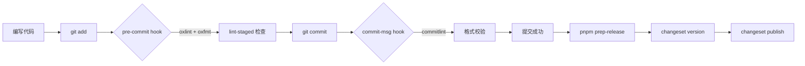
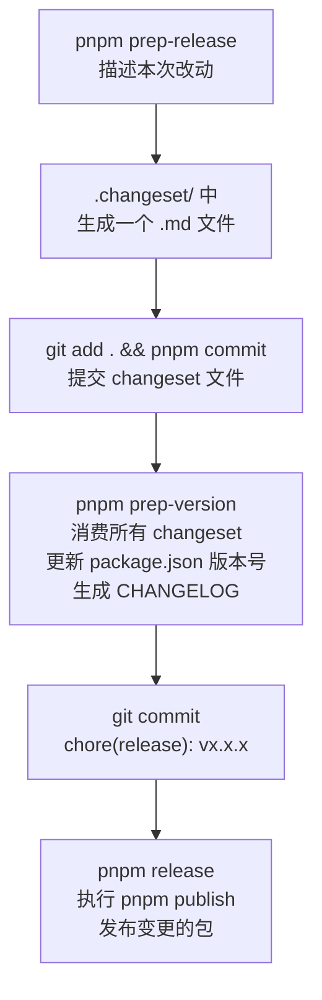

Monorepo 是一种将多个项目或包统一管理在同一个代码仓库中的工程实践。相比于多仓库（Polyrepo）模式，它能显著降低跨包协作的摩擦：共享构建配置、统一代码规范、原子化提交变更。

本文将从零搭建一套基于 **pnpm workspace** 的 Monorepo 脚手架，逐步集成以下能力：

- 📦 **包管理**：pnpm workspace + TypeScript 多包构建
- 🔍 **代码质量**：oxlint + oxfmt（Rust 驱动的高性能 Lint/Format）
- 🪝 **Git 规范**：husky + commitlint + commitizen
- 🚀 **发布管理**：Changesets 自动化版本与 ChangeLog

整体工作流如下：



## 项目初始化

首先创建项目目录并初始化根 `package.json`，注意将 `private` 设为 `true`——这可以防止根包被意外发布到 npm。

```bash
mkdir example-projects && cd example-projects
pnpm init -y
```

编辑 `package.json`，手动添加 `"private": true`。

### 配置 Workspace

pnpm 通过 `pnpm-workspace.yaml` 声明哪些目录是 workspace 包。所有匹配路径下的 `package.json` 都会被识别为独立的工作区包，包之间可以通过包名互相引用，无需发布到 npm。

```yaml
# pnpm-workspace.yaml
packages:
  - packages/*
```

### 安装 TypeScript

在根目录以 `-w`（workspace root）标志安装 TypeScript，所有子包可共享同一份依赖：

```bash
pnpm add -D -w typescript @types/node
```

创建根 `tsconfig.json`，作为所有子包的编译基准配置：

```json
{
  "compilerOptions": {
    "module": "commonjs",
    "declaration": true,
    "target": "es2017",
    "strict": true,
    "experimentalDecorators": true,
    "emitDecoratorMetadata": true,
    "skipLibCheck": true
  }
}
```

### 创建第一个包

```bash
mkdir -p packages/my-module/src
```

每个包都需要独立的 `package.json`，描述其名称、入口和构建脚本：

`packages/my-module/package.json`:

```json
{
  "name": "@my-scope/nestjs-my-module",
  "version": "0.0.0",
  "main": "lib/index.js",
  "files": ["lib"],
  "scripts": {
    "build": "tsc --build tsconfig.build.json",
    "test": "vitest run",
    "typecheck": "tsc --noEmit"
  },
  "peerDependencies": {
    "@nestjs/common": "^11.0.0",
    "@nestjs/core": "^11.0.0"
  },
  "publishConfig": { "access": "public" }
}
```

每个包继承根 `tsconfig.json`，仅覆盖 `outDir` 和 `rootDir`。同时拆分出 `tsconfig.build.json` 用于生产构建（排除测试文件）：

`packages/my-module/tsconfig.json`:

```json
{
  "extends": "../../tsconfig.json",
  "compilerOptions": { "outDir": "./lib", "rootDir": "./src" },
  "include": ["./src"]
}
```

`packages/my-module/tsconfig.build.json`:

```json
{
  "extends": "./tsconfig.json",
  "exclude": ["./src/**/*.spec.ts"]
}
```

NestJS 模块的典型目录结构如下，每类职责独立成文件，保持模块边界清晰：

```text
packages/my-module/src/
├── index.ts                       # 公共导出入口
├── my-module.module.ts            # NestJS 模块定义
├── my-module.decorators.ts        # 自定义装饰器
├── my-module.interfaces.ts        # 类型接口
├── my-module.constants.ts         # 常量
└── my-module-module-definition.ts # ConfigurableModuleBuilder 定义
```

## 配置 Lint 和 Format 工具

传统的 ESLint + Prettier 组合在大型 Monorepo 中往往成为性能瓶颈。本文选用 **Oxc** 生态的工具链替代：

| 工具 | 替代 | 性能提升 |
|------|------|----------|
| oxlint | ESLint | 快 50–100 倍 |
| oxfmt | Prettier | 快数十倍 |

> **什么是 Oxc？**
>
> The Oxidation Compiler is a collection of high-performance tools for JavaScript and TypeScript written in Rust.
> Oxc is part of [VoidZero](https://voidzero.dev/)'s vision for a unified, high-performance toolchain for JavaScript. It powers [Rolldown](https://rolldown.rs/) ([Vite](https://vitejs.dev/)'s future bundler) and enables the next generation of ultra-fast development tools that work seamlessly together.

安装 VSCode 插件 `oxc`，并更改项目内 IDE 设置 `.vscode/settings.json`，让编辑器在保存时自动格式化：

```diff
+ "oxc.enable": true,
+ "oxc.enable.oxlint": true,
+ "oxc.enable.oxfmt": true,
+ "editor.formatOnSave": true,
+ "editor.defaultFormatter": "oxc.oxc-vscode",
+ "editor.formatOnSaveMode": "file",
```

安装相关依赖：

```bash
pnpm add -D -w oxlint oxfmt lint-staged
```

### 配置 Oxlint

在根 `package.json` 中注册 lint 脚本：

```diff
{
  "scripts": {
+   "lint": "oxlint",
+   "lint:fix": "oxlint --fix"
  }
}
```

执行 `pnpm oxlint --init` 生成最小化配置文件 `.oxlintrc.json`：

```json
{
  "$schema": "./node_modules/oxlint/configuration_schema.json",
  "categories": {
    "correctness": "warn"
  },
  "rules": {
    "eslint/no-unused-vars": "error"
  }
}
```

更多规则配置参考 [oxlint 官方文档](https://oxc.rs/docs/guide/usage/linter/config.html)。

### 配置 Oxfmt

在根 `package.json` 中注册 format 脚本：

```diff
{
  "scripts": {
+   "fmt": "oxfmt",
+   "fmt:check": "oxfmt --check"
  }
}
```

执行 `oxfmt --init` 生成配置文件 `.oxfmtrc.json`：

```json
{
  "$schema": "./node_modules/oxfmt/configuration_schema.json",
  "printWidth": 80
}
```

更多格式化选项参考 [oxfmt 官方文档](https://oxc.rs/docs/guide/usage/formatter/config.html)。

## 配置 lint-staged

直接对全量代码运行 lint 效率低下。**lint-staged** 的核心思想是：**只检查当前暂存（`git add`）的文件**，大幅缩短每次提交的等待时间。

在根 `package.json` 中新增：

```diff
+ "lint-staged": {
+   "*.{ts,tsx}": [
+     "oxlint --fix",
+     "oxfmt --check"
+   ]
+ },
```

这样每次提交时，只有被 `git add` 的 `.ts`/`.tsx` 文件才会经过 lint 修复和格式检查。

## 配置 Git 提交规范

规范的提交信息是自动化发布的前提。本节通过三个工具构建完整的提交管控链路：

- **commitizen**：交互式生成符合规范的提交信息
- **commitlint**：校验提交信息格式
- **husky**：在 Git hook 阶段触发上述工具

安装相关依赖：

```bash
pnpm add -wD @commitlint/cli husky @commitlint/config-conventional commitizen cz-conventional-changelog
```

在根 `package.json` 中补充脚本和配置：

```diff
{
  "scripts": {
+   "commit": "cz",
+   "prepare": "husky"
  },
  "devDependencies": {
+   "@commitlint/cli": "^21.0.1",
+   "@commitlint/config-conventional": "^21.0.1",
+   "commitizen": "^4.3.1",
+   "cz-conventional-changelog": "^3.3.0",
+   "husky": "^9.1.7",
    "typescript": "^6.0.3"
  },
+ "config": {
+   "commitizen": {
+     "path": "cz-conventional-changelog"
+   }
+ },
  "packageManager": "pnpm@10.13.1"
}
```

`"prepare": "husky"` 会在 `pnpm install` 后自动执行，完成 husky 初始化。

### 配置 Git Hooks

执行 `pnpm husky init` 初始化 `.husky/` 目录，然后编辑两个 hook 文件。

**`commit-msg`**：拦截格式非法的提交信息

```bash
pnpm exec commitlint --edit $1
```

**`pre-commit`**：提交前执行 lint-staged 和测试

```bash
echo "Running lint-staged"
pnpm exec lint-staged

echo "Running tests"
pnpm test
```

完成后，使用 `git add . && pnpm commit` 发起第一次提交，commitizen 会引导你通过交互式界面填写提交类型、范围和描述。

## 发布管理

### 选型：为什么用 Changesets？

传统的 `lerna` + `standard-version` 方案将"描述变更"和"版本提升"绑定在同一次操作中，多人协作时容易产生冲突。

**Changesets** 将这两件事解耦：

1. 开发者在完成功能后，单独提交一个描述变更意图的 `.md` 文件（changeset）
2. 发布时，工具统一消费所有积累的 changeset，自动计算版本号并生成 CHANGELOG

> pnpm 从 v8+ 已原生支持 monorepo 批量发布：`pnpm publish -r`

### 安装与初始化

```bash
pnpm add -w -D @changesets/cli
npx changeset init
```

初始化后会生成 `.changeset/config.json`：

```json
{
  "$schema": "https://unpkg.com/@changesets/config@3.1.4/schema.json",
  "changelog": "@changesets/cli/changelog",
  "commit": false,
  "fixed": [],
  "linked": [],
  "access": "restricted",
  "baseBranch": "main",
  "updateInternalDependencies": "patch",
  "ignore": []
}
```

在根 `package.json` 中注册发布脚本：

```diff
{
  "scripts": {
+   "prep-release": "changeset",
+   "prep-version": "changeset version",
+   "release": "changeset publish"
  },
  "devDependencies": {
+   "@changesets/cli": "^2.31.0"
  }
}
```

### 标准发布流程



**Step 1**：feature 或 fix 完成后，执行 `pnpm prep-release`，交互式选择受影响的包和变更类型（patch / minor / major），并填写变更描述。

**Step 2**：将生成的 changeset 文件一起提交：

```bash
git add . && pnpm commit
```

**Step 3**：准备发布时，执行版本计算：

```bash
pnpm prep-version
```

此命令会消费 `.changeset/` 中所有积累的文件，自动更新各包的 `package.json` 版本号，并生成 `CHANGELOG.md`。

**Step 4**：提交版本变更并发布：

```bash
pnpm commit   # 提交 chore(release): vx.x.x
pnpm release  # 发布到 npm
```

在发布前，确认 npm 登录状态：

```bash
npm whoami    # 查看当前登录用户
npm login     # 未登录时执行
```

---

至此，一个具备完整工程规范的 Pnpm Monorepo 脚手架已搭建完毕。从代码检查、提交规范到自动化发布，每个环节都有对应工具兜底，团队协作效率和代码质量可以得到有效保障。
