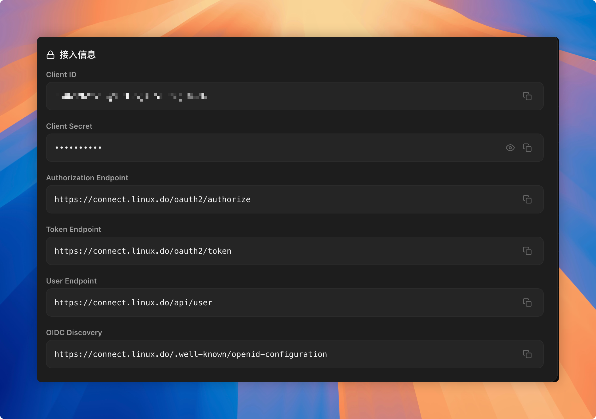
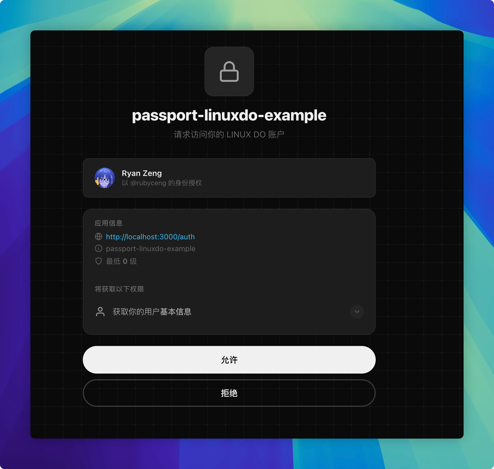

## 什么是 OAuth 2.0？

OAuth 是一个关于授权（authorization）的开放网络标准，在全世界得到广泛应用，目前的版本是 2.0 版。

在 OAuth 2.0 前，试想一个场景：

某日程管理 App 想读取你的 Google 日历。它要求你输入 Google 账号和密码，再读取 Google 日历的相关 API，也就是说如果第三方应用想访问你的账户资源，常见做法是让你把用户名和密码交给它。

从这个场景就可以感受到，有非常大的安全隐患：一个是第三方 App 可以获取你的 Google 账号和密码，其次无法控制第三方访问资源的边界，例如你并不能控制他只访问日历而不进行别的操作，如修改日历信息等。即使你完全信任第三方，但第三方出现数据泄露的时候，你的账号和密码也会被泄露。

## Oauth 是如何解决这些问题的？

OAuth 在"客户端"与"服务提供商"之间，设置了一个授权层（authorization layer）。"客户端"不能直接登录"服务提供商"，只能登录授权层，以此将用户与客户端区分开来。"客户端"登录授权层所用的令牌（token），与用户的密码不同。用户可以在登录的时候，指定授权层令牌的权限范围和有效期。

以下是 OAuth 2.0 的授权流程：

```text
+------------------+                                      +----------------------+
|                  |--(A)- 授权请求 --------------------> |      资源所有者      |
|                  |                                      |   Resource Owner     |
|                  |<-(B)-- 授权许可 -------------------- |                      |
|                  |                                      +----------------------+
|                  |
|                  |                                      +----------------------+
|                  |--(C)-- 授权许可 -------------------> |      认证服务器      |
|      客户端      |                                      | Authorization Server |
|      Client      |<-(D)------ 访问令牌 ---------------- |                      |
|                  |                                      +----------------------+
|                  |
|                  |                                      +----------------------+
|                  |--(E)------ 访问令牌 ---------------> |      资源服务器      |
|                  |                                      |   Resource Server    |
|                  |<-(F)--- 受保护资源 ----------------- |                      |
|                  |                                      +----------------------+
+------------------+
```

> 通常授权服务器与资源服务器是分开的，资源服务器不需要知道密码，只负责验证访问令牌的有效性，授权服务器负责验证用户的身份和授权。

### 授权模式

授权模式有四种：

1. 授权码模式（Authorization Code Grant）
2. 隐式授权模式（Implicit Grant）
3. 密码模式（Resource Owner Password Credentials Grant）
4. 客户端模式（Client Credentials Grant）

### 授权码模式

```text
+------------------+                                         +----------------------+
|                  |--(A)- Authorization Request ----------> |    Resource Owner    |
|                  |       (via browser)                     |                      |
|                  |                                         |                      |
|                  |<-(B)-- Authorization Grant (code) ----- |                      |
|                  |       (redirect with code)              +----------------------+
|                  |
|                  |                                         +----------------------+
|                  |--(C)-- Authorization Code ------------> | Authorization Server |
|      Client      |       + Client Credentials              |                      |
|                  |                                         |                      |
|                  |<-(D)------ Access Token --------------- |                      |
|                  |          (+ Refresh Token)              +----------------------+
|                  |
|                  |                                         +----------------------+
|                  |--(E)------ Access Token --------------> |   Resource Server    |
|                  |                                         |                      |
|                  |<-(F)--- Protected Resource ------------ |                      |
|                  |                                         +----------------------+
+------------------+


(A) 客户端引导用户通过浏览器访问授权服务器，请求授权（包含 client_id、redirect_uri、scope、state 等）。
(B) 用户登录并同意授权，授权服务器通过重定向返回授权码（code）。
(C) 客户端携带授权码 + client_secret 向授权服务器请求访问令牌。
(D) 授权服务器校验通过，返回 access_token（可选 refresh_token）。
(E) 客户端使用 access_token 请求资源服务器。
(F) 资源服务器校验令牌，返回受保护资源。
```

OAuth 2.0 定义了多种获取 Token 的方式（Grant Types），其中最安全、也是目前绝对主流的是授权码模式（Authorization Code Flow）。

> 通常授权服务器返回 AccessToken 的同时还会返回一个 RefreshToken，AccessToken 有效期较短，RefreshToken 有效期较长，客户端可以使用 RefreshToken 来获取新的 AccessToken，无需用户再次授权。

## Passport 对接 Linux Do Connect 实战模拟

使用 LinuxDO Connect 提供的 [OIDC Discovery](https://connect.linux.do/.well-known/openid-configuration)。在 Linux DO Connect / 应用接入 中创建一个 App，获取 Client ID 和 Client Secret，设置回调地址 `http://localhost:3000/auth/callback`。

> OIDC Discovery Document（OIDC 发现文档）是 OpenID Connect 协议中的一个标准 JSON 文档，用于帮助客户端应用自动发现 OpenID Provider（OP，即身份提供商）的配置信息。



**Authorization EndPoint**：授权服务器地址

**Token EndPoint**：获取 Access Token 的地址

**User Endpoint**：获取用户信息的地址

### Passport.js 是什么？

Passport.js 是一个运行在 Node.js 环境中的认证中间件，用于处理用户登录、身份验证以及授权逻辑。它采取策略模式，封装了 OAuth 2.0 以及其他认证方式。社区也提供了大量的认证策略（Strategy），例如 Google、Facebook、GitHub 等第三方登录，甚至还有一些企业级的认证协议如 SAML、LDAP 等。

[社区提供的认证策略](https://www.passportjs.org/packages/)

就用它来对接 LinuxDO Connect 吧！我们使用 `passport-oauth2` 这个通用的 OAuth 2.0 策略来实现。

### 核心实现

创建 Stategy，OAuth2Strategy 处理授权码模式中从授权服务器获取 Access Token 的逻辑。

重写 userProfile 方法处理获得 Access Token 后获取用户信息的逻辑。

```typescript
export class Strategy  extends OAuth2Strategy {
    constructor(options: any, verify: any) {
    super({
      ...options,
      authorizationURL: 'https://connect.linux.do/oauth2/authorize',
      tokenURL: 'https://connect.linux.do/oauth2/token',
    }, verify);

    this.name = 'linuxdo';
    // 让 access token 以 Authorization Header 的方式发送，符合 OAuth2.0 标准
    this._oauth2.useAuthorizationHeaderforGET(true);
  }

  // 请求用户资源
  userProfile(accessToken: string, done: (err?: Error | null, profile?: any) => void) {
    this._oauth2.get('https://connect.linux.do/api/user', accessToken, (err, body, res) => {
      if (err) {
        return done(new InternalOAuthError('Get User Profile Failed', err));
      }

      try {
        const profile: UserProfile = JSON.parse(body as string) ;
        done(null, profile);
      } catch (ex) {
        done(new Error('User Profile Parsing Failed'));
      }
    });
  }
}
```

### Example

构建一个 Express 应用作为服务端，使用 Passport.js 处理登录认证逻辑，前端使用纯 HTML 展示用户信息。

```typescript
import dotenv from 'dotenv';
import express from 'express';
import session from 'express-session';
import passport from 'passport';
import type { UserProfile } from '../../lib/profile.js';
import { Strategy } from '../../lib/stategy.js';

const app = express();

dotenv.config();

app.use(session({
  secret: 'linuxdo-super-secret-key',
  resave: false,
  saveUninitialized: true,
}));

app.use(passport.initialize());
app.use(passport.session());


passport.serializeUser((user, done) => {
  done(null, user);
});
passport.deserializeUser((user, done) => {
  done(null, user as any);
});

passport.use(new Strategy({
  clientID: process.env.CLIENT_ID || '',
  clientSecret: process.env.CLIENT_SECRET || '',
  callbackURL: 'http://localhost:3000/auth/callback',
}, (accessToken: string, refreshToken: string, profile: any, done: Function) => {
  console.log('🎉 成功获取到 Access Token:', accessToken);
  console.log('👤 解析到的标准 Profile:', profile);

  // 在这里可以进行数据库查找或创建用户的操作
  // User.findOrCreate({ ssoId: profile.id }, function (err, user) {
  //   return done(err, user);
  // });

  return done(null, profile);
}));

// 首页：提供一个登录入口
app.get('/', (req, res) => {
  res.send(`
    <h2>Passport OAuth2 测试</h2>
    <a href="/auth">点击使用 SSO 登录</a>
  `);
});

app.get('/profile', (req, res) => {
  if (!req.isAuthenticated()) {
    return res.redirect('/');
  }
  const user = req.user as UserProfile;
  res.send(`
    <h2>欢迎回来，${user.name}！</h2>
    
    <pre>${user.name}</pre>
    <a href="/logout">退出登录</a>
  `);
});

// 触发鉴权：进入该路由后，Passport 会组装参数并 302 重定向到授权页
app.get('/auth', passport.authenticate('linuxdo'));

// 回调路由：用户在授权页同意后，第三方会携带 code 跳转回这里
app.get('/auth/callback', passport.authenticate('linuxdo', {
  successRedirect: '/profile', // 成功后跳往个人信息页
  failureRedirect: '/',        // 失败则退回首页
}));

app.get('/logout', (req, res, next) => {
  req.logout((err) => {
    if (err) return next(err);
    res.redirect('/');
  });
});

app.listen(3000, () => {
  console.log('服务器已启动，访问 http://localhost:3000/auth 开始登录流程');
});

```

### 效果：

使用 `npm run start` 运行 express。

访问 `http://localhost:3000/auth`，会被重定向到 LinuxDO Connect 的授权页，登录并同意授权后会被重定向回 `http://localhost:3000/auth/callback`，最终展示用户信息。




## 参考文章

- [OAuth 2.0 简介](https://www.digitalocean.com/community/tutorials/an-introduction-to-oauth-2)
- [Passport.js 官方文档](https://www.passportjs.org/)
- [阮一峰的网络日志](https://www.ruanyifeng.com/blog/2014/05/oauth_2_0.html)
- [passport-github2](https://www.npmjs.com/package/passport-github2)
